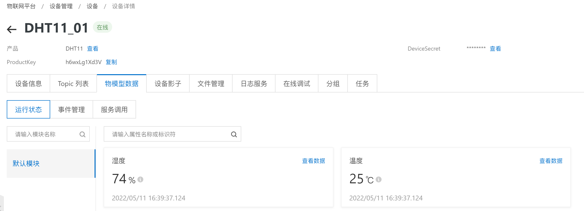
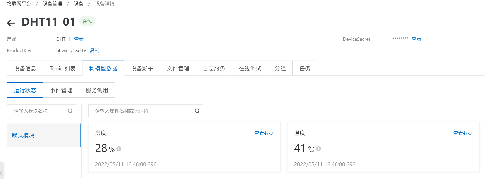
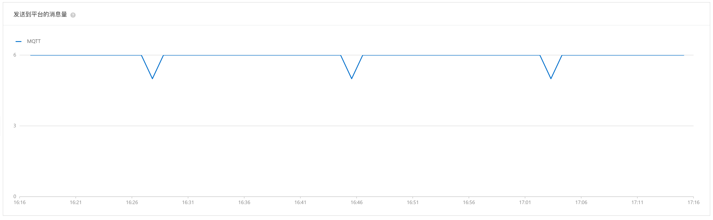

# THMS_IoT
Temperature and humidity monitoring system based on Internet of things. 基于物联网的温湿度监控系统

## 项目基础

本项目在 [STM32 Project](https://github.com/Deng-Jiajun/STM32-Project) 的基础上建立

## 硬件基础

MCU：stmf103c8t6  
温湿度检测：DHT11  
联网：esp-01s

## 基本工作流程

esp-01s 联网，与阿里云物联网平台 MQTT 服务器建立 TCP 连接，定期通过 DHT11 检测当前环境温湿度数据并上传

## 重点模块

- IIC：实现 MCU 与 DHT11 的通信协议支持
- DHT11：实现 MCU 与 DHT11 的实际通信
- USART：实现 MCU 的串口通信
- WiFi：实现 MCU 与 esp-01s 的通信（基于 USART2 串口通信）
- MQTT：实现 MCU 与 MQTT 服务器的通信（在 WiFi 模块的基础上实现）

## 运行结果

### 室温

### 电吹风

## 修改内容

这里记录一些在 [STM32 Project/Template](https://github.com/Deng-Jiajun/STM32-Project/tree/main/Template) 基础上进行的比较重要的修改（针对功能性的），细节的修改不作赘述。
1. 修改了 USART2 的接收中断处理函数  
    
    **AT 指令的响应似乎要求数据不为 0**  
    没有印象哪里有提到过这点，但是最开始写中断处理函数的时候确实是做了数据 0 的丢弃逻辑  
    
    **MQTT 的响应是明确存在数据 0 的**  
    当时在编写 MQTT 模块时也是排查了很久，才发现中断处理程序把数据 0 抛弃了，所以修改了中断处理程序，把数据 0 也写入了缓冲区  
    修改后测试的过程中也发现好像 WiFi 模块的初始化不太顺畅，但是多试几次也能连上，所以并没有往这个方向考虑
    
    总之，由于 AT 指令的响应和 MQTT 报文的响应有所不同，所以添加了一个全局变量 `AT_Instruction_Mode` 用于判断目前串口接收到的应该是什么类型的数据，以此判断是否要把数据 0 写入缓冲区
    
2. 删除了将 MQTT 报文写入输出缓冲区前将输出缓冲区清零的代码
    
    这个清零实际上也没有什么意义，只是觉得清零一下再写入比较合适
    
    结果排查到最后发现是这里有问题，具体原因不清楚，完全没搞懂为什么程序会卡在 memset 这里，总之把它注释了就没问题了

## 其他问题

在主函数中，我添加了 5 秒的延迟，目的是让温湿度数据每 5 秒上传一次，结果查看在线数据，发现实际的时间间隔大约是 10 秒（每分钟 6 次）

最后发现在发送报文时，添加了 5 秒的等待时间，用于等待报文响应